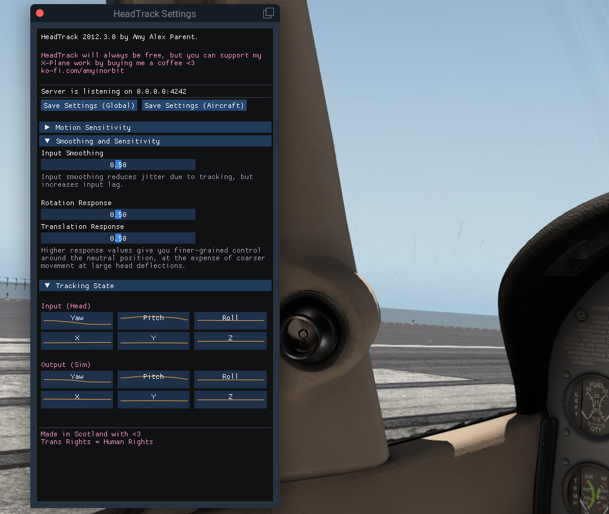
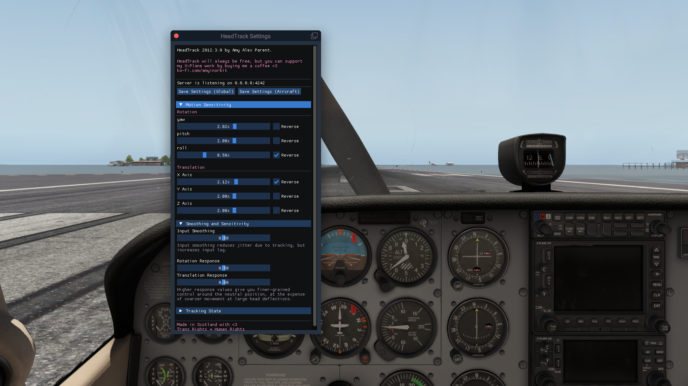

# HeadTrack

HeadTrack is a lightweight plugin for X-Plane that lets you use apps like [SmoothTrack][smoothtrack] to control the cockpit view position and orientation.

HeadTrack is made with <3 in Scotland. HeadTrack will always be free! If you want to support my X-Plane work, you can [buy me a coffee ☕][ko-fi].

## Installation

Extract the [downloaded][releases] zip file drop the `htrack` in `x-plane/Resources/plugins`.

## Usage

You can enable and disable head tracking, as well as reset the center head and in-simulator positions in the `Plugins > HeadTrack` menu in X-Plane. Point your head tracking app to your PC's IP address and port `4242`, and you should be good to go!

The settings window lets you tweak tracking sensitivity, smoothing and response. It also displays graphs of the current received head position, and of the corresponding cockpit position if tracking is active.

Settings saved globally are stored in `x-plane/Resources/plugins/htrack/config.json`. You can also save settings per-plane, and these will be loaded automatically when you load specific planes. These are stored as `htrack.json` in the plane's folder. This can be useful if you want snappier settings for fighter planes and something calmer for jet liners, for example.

## Bugs & Suggestions

If you find any bugs or have suggestions on how to make HeadTrack better, you can file an issue here, email me at <developer@amyparent.com>, or fork this repository and hack away!

## Building

If you want to build HeadTrack from source yourself, you will need a C/C++ compiler, CMake 3.12+, and the [cJSON][cjson] library (this was only tested on gcc-style toolchains, including MingW on Windows. It probably will not work with Visual Studio).

🏳️‍⚧️

[smoothtrack]: https://smoothtrack.app/
[releases]: https://github.com/amyinorbit/headtrack/releases
[ko-fi]: https://ko-fi.com/amyinorbit
[cjson]: https://github.com/DaveGamble/cJSON
